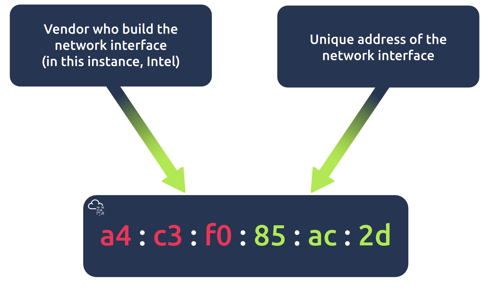

# Networking Concepts

- **OSI model** - Open Systems Interconnection
	- developed by ISO
	- _Please Do Not Throw Spinach Pizza Away_

- OSI layers:
1. Physical
2. Data Link
3. Network
4. Transport
5. Session
6. Presentation
7. Application

- **1. Physical**
	- _layer 1_
	- medium: electrical, optical or wireless
	- definition of binary digits 0 and 1
- **2. Data Link**
	- protocol that enables data transfer
	- e.g. Ethernet (802.3), WiFi (802.11)
		- addresses have six bytes - MAC address (Media Access Control)
			- expressed in hexadecimal format: _a4:c3:f0:85:ac:2d_
				- each two hexadecimal digits are one byte
